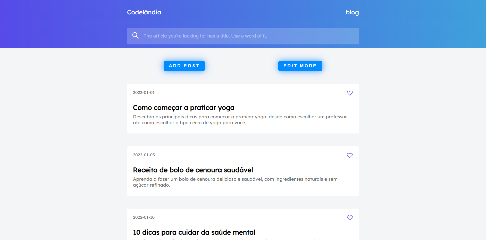

<h1 align="center"> Todo com ReactJs 💻 </h1>

## Briefing 📄

In order to improve my react i'm using codelândia challenge one. This time I'll be building this simple frontend using react. I did it last time whith pure html and css.

It does have "edit mode" and "add post" options but they aren't properly working because I did some mistakes while building how the "posts" would be storaged and all the code is messing up. I giving up on it lol, there is no reason to keep trying add more features since they are buging each other. Next project I'll be doing it right. 

> [Reference to design owner](https://github.com/luansilvae)

> [Acessar](https://bulogui.web.app)

<h2 align="left"> Objetivo 📌 </h2>

- Improve ReactJs skills.

---

<h3 align="center"> Home 📷 </h3>

<h3 align="center"> Tecnologias utilizadas 🤖 </h3>

> 

